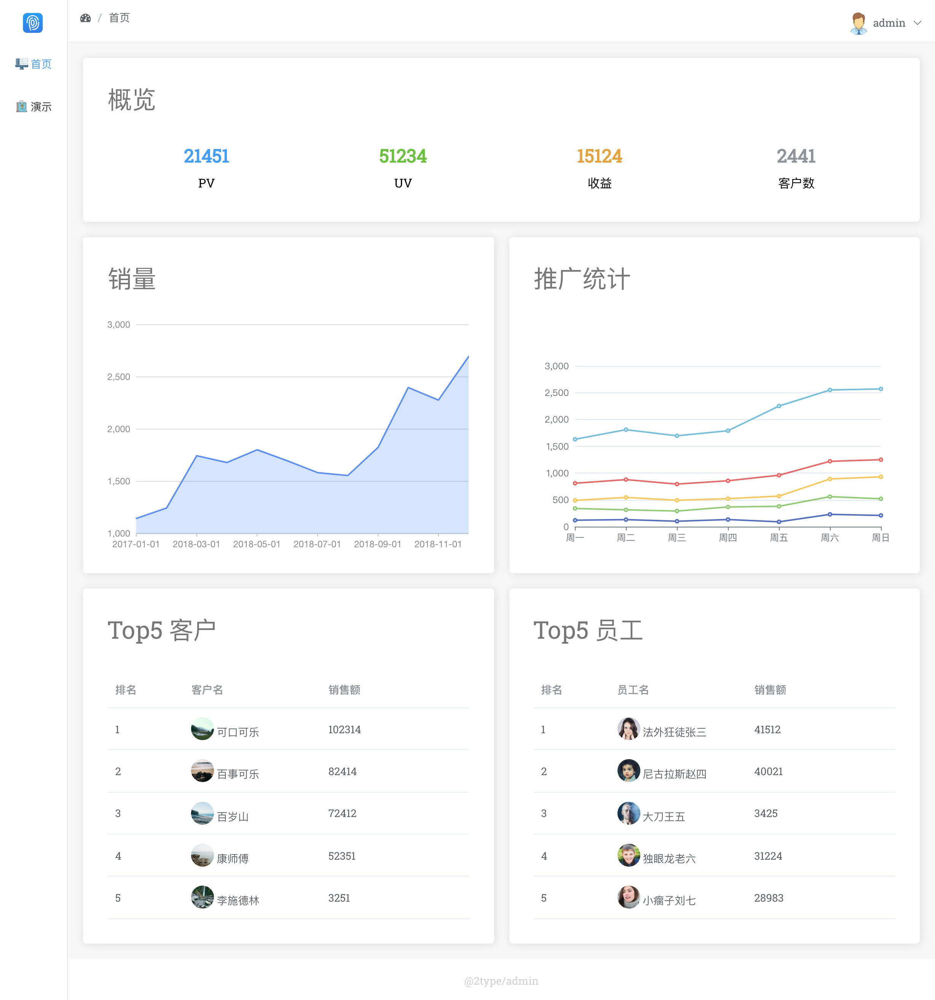
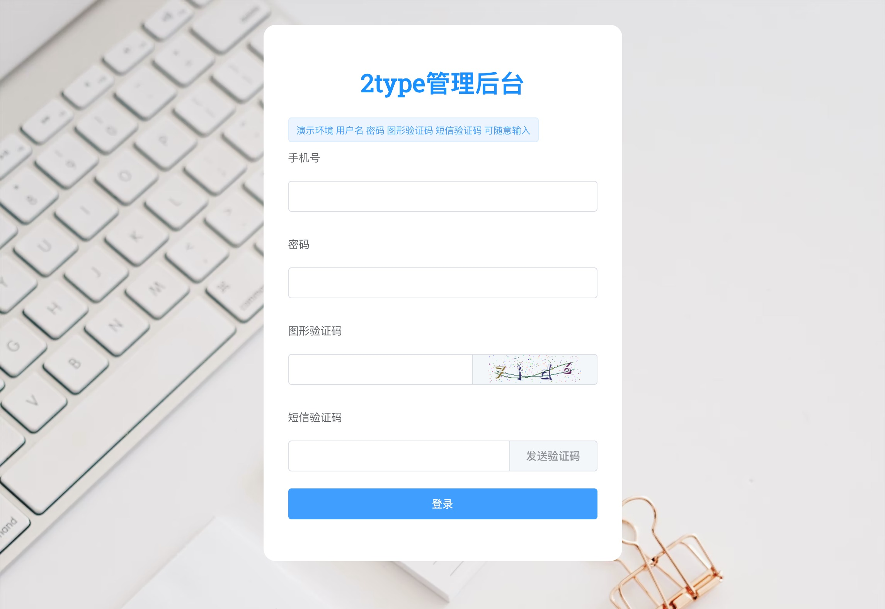
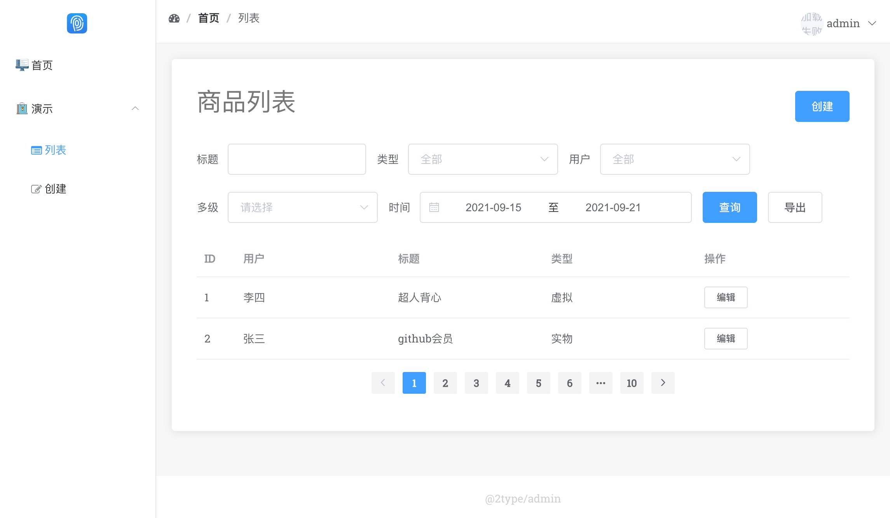
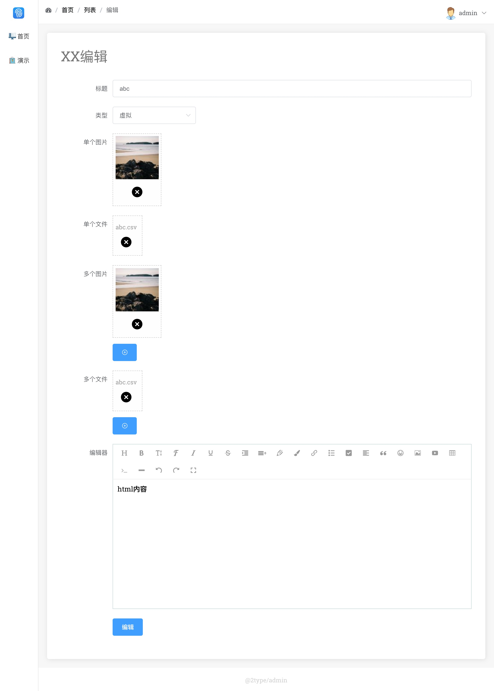

# 2type/admin

首页
[](http://121.36.160.254:4122/admin/home)

登录
[](http://121.36.160.254:4122/admin/login)

列表
[](http://121.36.160.254:4122/admin/demo_list)

编辑
[](http://121.36.160.254:4122/admin/demo_update)


 

## 特色

**无需编译:**

2type/admin 可以作为管理后台框架,也可以作为前端快速开发的原型框架.无需 node webpack gulp 等编译能降低复杂度.
对后端友好,不是很熟悉前端的后端只需要复制粘贴即可完成管理后台的前端开发,复杂的需求让前端在 2type/admin 的框架之上开发即可.

> 编译在前端正式项目中是必须的,但是在管理后台就显得非常繁琐.反而会降低开发效率,管理后台应该是让后端能参与的.

**基于Vue生态**

使用非常成熟且易用的 [vue2](https://cn.vuejs.org/v2/guide/) 作为基础框架.
既能快速开发,又能使用 [element](https://element.eleme.io/2.15/#/zh-CN/component/form) 这样成熟的组件库.

> vue3 不适合管理后台这样无需编译的场景,并且 vue2 的生态目前比 vue3 成熟

**灵活自由**

提供了 _list _submit _find 等方法来解决常用的 列表页面, 表单页面, 字典查询等需求

> 在实际角度出发,管理后台框架的重点不在于组件库有多少,而是要快速的配置简单的增删查改页面

## 安装

下载 https://github.com/2type/admin/archive/refs/heads/main.zip

### 配置文件

1. [project.js](./project.js) 项目配置
1. [project.auth.js](./project.auth.js) 项目配置 `授权(登录)后才能访问的项目配置`
1. [project.css](./project.css) 项目样式 

### 静态资源
1. [2type/**](./2type/) 项目所需静态资源,不要改动这里的代码

### 模板文件

1. [view/layout/page.html](./view/layout/page.html) 模板布局文件,可根据项目后端语言修改成对应的后端模板
1. [view/login.html](./view/layout/login.html) 登录页面
1. [view/home.html](./view/layout/login.html) 首页
1. [view/demo_list.html](./view/layout/demo_list.html) 列表页面
1. [view/demo_form.html](./view/layout/demo_form.html) 创建和编辑页面 通过 __RENDER_DATA.formKind 控制创建和编辑的区别


## 必须阅读

### esm

项目中可直接使用 `import` 导入js模块,但要注意一定要在 `<script type="module" >` 标签的起始处, 必须有 `type="module"`.

在线 esm 模块: https://www.skypack.dev/

国内加速镜像: https://esm.2type.cn/


### 最好有一点vue基础

1. 文档 https://cn.vuejs.org/v2/guide/
2. 视频 https://learning.dcloud.io/

### 标签闭合

因为 Vue 模板是写在html中,而不是通过编译生成.所以应该确保每个标签都是有起始和结束.

```html
<!--正确-->
<el-switch></el-switch>

<!--错误-->
<el-switch/>
<!--错误-->
<el-switch>
```

如果不按照正确的语法,会导致页面无法正常显示,或显示错误.

### 后端数据

页面中 `__RENDER_DATA` 变量是用来存放后端渲染数据的

> 前端开发人员可以跳过后端数据这一部分内容,让后端同事看这一部分内容

**某后端模板**
```html
<script>
    window.__RENDER_DATA = [[raw(xjson(.))]]
</script>
```

**某后端模板引擎渲染语法**
```js
var data = {
    list: [{name:"2type"}]
}
var t = view.getTemplate("list.html")
t.render(data)
```

**渲染结果**
```html
<script>
    window.__RENDER_DATA = {list: [{name:"2type"}]}
</script>
```


### ... 扩展语法

> vm 指的是 `new Vue({...})` 创建的实例

将 __RENDER_DATA 的数据导入 vm.data
```js
{
    ...__RENDER_DATA,
}
```

将 TA.m 的数据导入 vm.methods

```js
methods: {
    ...TA.m,
},
```

> 如果你误删了 `...__RENDER_DATA,` 或者 `...TA.m,` 可能会导致某些功能失效 

### 本地预览

1. [main.go](./main.go) go 语言示例环境,可以安装 https://golang.org/ 后在当前目录运行 go run main.go

## 组件

### ta-page

> 页面
> 
```html
<ta-page :header="header">
</ta-page>
```

```js
const header = [
    {
        title: "首页",
        url: TA.m.url_home(),
    },
    {
        title: "列表",
        // 一般最后一个参数 url 可留空
    },
]
```
导航部分在 [./project.js](./project.js) 中通过 TA.nav 控制

```js
TA.nav = {
    // 头部
    top: {
        logo: 'https://2type.nimo.run/icon/logo.svg',
    },
    // 退出登录
    logoutURL: TA.m.url_logout(),
    // 导航
    items: [
        {
            url: TA.m.url_home(),
            // 可在 https://icon.2type.cn/ 中寻找 icon
            icon: 'display',
            title: "首页",
        },
        {
            icon: 'shopping',
            title: "演示",
            items: [
                {
                    // 可在 http://www.fontawesome.com.cn/faicons/ 中寻找fontawesome
                    fontawesome: 'list-alt',
                    url: TA.m.url_demo_list(),
                    title: '列表',
                },
                {
                    fontawesome: 'pencil-square-o',
                    url: TA.m.url_demo_create(),
                    title: '创建',
                },
            ]
        },
    ]
}
```
底部部分在 [./project.js](./project.js) 中通过 TA.footer 控制

```js
TA.footer = {
    link: {
        text: "@2type/admin",
        href: "https://github.com/2type/admin",
    }
}
```

### ta-box

> 盒子

```html
<ta-box title="商品列表">
    内容
</ta-box>
```

你可以在一个页面放多个 ta-box

```html
<el-row :gutter="20">
    <el-col :span="12">
        <ta-box title="Top5 客户">
           内容1
        </ta-box>
    </el-col>
    <el-col :span="12">
        <ta-box title="Top5 员工">
           内容2
        </ta-box>
    </el-col>
</el-row>
```

还可在右上角增加一些元素

```html
<ta-box title="商品列表">
    <template slot="tools">
        <el-button @click="_jump(url_demo_create())" type="primary" >创建</el-button>
    </template>
    内容
</ta-box>
```

### ta-editor

> 富文本编辑器

```html
<ta-editor v-model="form.content" photo="/admin/upload/photo" > ></ta-editor>
```

photo 参数用来配置图片上传的地址

可以在 [./project.js](./project.js) 中修改 `insertImage` 匹配后端响应并插入图片
```js
// 配置富文本编辑器的上传图片插入
TA.hook.editor.insertImage = function (res, insert) {
    insert(res.data.src)
}
```

### ta-upload

```html
<ta-upload v-model="form.photo" action="/admin/upload/photo" ></ta-upload>
<ta-upload v-model="form.file" action="/admin/upload/file" ></ta-upload>
```

```js
{
  form: {
    title: 'abc',
    file: {
      filename: "abc.csv",
      id: "some_uuid",
    },
    photo: {
      src: "https://picsum.photos/100",
      id: "https://picsum.photos/100",
    },
  }
}
```

通过响应 src 来实现上传图片

`POST /admin/upload/photo`

```json
{
  "src": "https://picsum.photos/100",
  "id": "https://picsum.photos/100",
  "error": {
    "code": 0,
    "message": ""
  }
}
```

通过响应 filename 来实现上传文件

`POST /admin/upload/file`

```json
{
  "filename": "abc.pdf",
  "id": "some_id",
  "error": {
    "code": 0,
    "message": ""
  }
}
```

### ta-upload-list

与 upload 类似,区别是可以上传多个文件

```html
<ta-upload-list v-model="form.photoList" action="/admin/upload/photo" ></ta-upload-list>
<ta-upload-list v-model="form.fileList" action="/admin/upload/file" ></ta-upload-list>
```

```js
{
    form: {
        photoList: [
            {
                src: "https://picsum.photos/100",
                id: "https://picsum.photos/100",
            },
        ],
            fileList: [
            {
                filename: "abc.csv",
                id: "some_uuid",
            }
        ]
    }
}
```


### 地区

**地区选择**

`<ta-region v-model="form.region"></ta-region>`


**地区限制**通过

1. ♾️不限地区
2. ✅包含区域
3. 🚫排除区域
4. 🔗组合模式

四种模式加上地区选择器,可以简单灵活的配置地区限制,如果后端使用mongo则可以快速完成地区筛选.

```html
<ta-lbs-limit v-model="form.area"></ta-lbs-limit>
```

不同选择 `form.area` 对应的值

```html
<!-- 可以通过 :debug="true" 查看所有省市区结构 --> <ta-lbs-limit :debug="true" v-model="form.area"></ta-lbs-limit>
```

> 它们的ID存储的是 adcode [行政区划](https://lbs.qq.com/service/webService/webServiceGuide/webServiceDistrict)

```js
// ♾️不限地区
{"type":"unlimited","inverse":[],"selected":[]}
```
```js
// ✅包含区域
{"type":"selected","inverse":[],"selected":["110000","110101"]}
```

```js
🚫排除区域
{"type":"inverse","inverse":["120102","120103"],"selected":[]}
```
```js
// 🔗组合模式
{"type":"selectedAndInverse","inverse":["110101"],"selected":["110000","120000"]}
```

对应的 mongoDB 代码


集合的数据结构
```json
{
	"advertisingID": 1,
	"areaLimit": {
		"type": "unlimited",
		"inverse": [],
		"selected": []
	}
}
```    


假设用户的位置是 `310113`

> 查询1,2这两个广告 `advertisingID:{$in: [1,2]}`
> 并且 `$and`
> 它们的限制规则必须**至少**满足以下4项的其中一项 `$or`
> 1. 包含模式的包含区域中**存在** `310112`
> 2. 排除模式的排除区域中**不存在** `310112`
> 3. 组合模式的包含区域中**存在** `310112` 并且 排除区域中**不存在** `310112`
> 4. 不限地区  

```mongo
db.advertisingRule.find({
    $and: [{
        "advertisingID": {
            $in: [1,2,]
        }
    },
    {
        $or: [
            {
                "areaLimit.type": "selected",
                "areaLimit.selected": {$in: ["310112"]},
            },
            {
                "areaLimit.type": "inverse",
                "areaLimit.inverse": {$nin: ["310112"]}
            },
            {
                "areaLimit.type": "selectedAndInverse",
                "areaLimit.selected": {$in: ["310112"]},
                "areaLimit.inverse": {$nin: ["310112"]}
            },
            {
                "areaLimit.type": "unlimited",
            },
        ]
    }]
})
```

> 你可能还需要使用 [https://github.com/goclub/lbs](goclub/lbs]) 来查询一些地区的上下级

### element-ui

2type/admin 中已经集成了 element-ui 可直接使用无需引用

1. [element table](https://element.eleme.io/2.15/#/zh-CN/component/table)
1. [element form](https://element.eleme.io/2.15/#/zh-CN/component/form)

# vant

2type/admin 的移动端模式使用了

1. [vant v2](https://youzan.github.io/vant/v2/#/zh-CN/)
2. [vue router v3](https://v3.router.vuejs.org/zh/guide/#javascript) *非必须了解*
3. [vuex v3](https://v3.vuex.vuejs.org/zh) *非必须了解*

### 图表

```html
<div ref="g2ChartNode" style="mountedheight:300px" ></div>
<div ref="saleChartNode" style="height:300px" ></div>
```

```js
// 使用前需先引用 (记得在 <script type="module" > 开头引用)
import g2 from 'https://esm.2type.cn/@antv/g2@v4.1.27/dist/g2.min.js'
import echarts from "https://esm.2type.cn/echarts@5.2.1/dist/echarts.min.js"
```

```js
mounted() {
    const vm = this
    setTimeout(function () {
        // 使用前请确保 <script type="module" > 起始处引用了
        // import echarts from "https://esm.2type.cn/echarts@5.2.1/dist/echarts.min.js"
        var chart = echarts.init(vm.$refs.saleChartNode);
        // 配置参考 https://echarts.apache.org/examples/zh/editor.html?c=line-stack
        const option = {
            tooltip: {trigger: 'axis'},
            legend: {data: ['Email', 'Union Ads', 'Video Ads', 'Direct', 'Search Engine']},
            grid: {left: '3%', right: '4%', bottom: '3%', containLabel: true},
            toolbox: {feature: {saveAsImage: {}}},
            xAxis: {type: 'category', boundaryGap: false, data: ['Mon', 'Tue', 'Wed', 'Thu', 'Fri', 'Sat', 'Sun']},
            yAxis: {type: 'value'},
            series: [{
                name: 'Email',
                type: 'line',
                stack: 'Total',
                data: [120, 132, 101, 134, 90, 230, 210]
            }, {
                name: 'Union Ads',
                type: 'line',
                stack: 'Total',
                data: [220, 182, 191, 234, 290, 330, 310]
            }, {
                name: 'Video Ads',
                type: 'line',
                stack: 'Total',
                data: [150, 232, 201, 154, 190, 330, 410]
            }, {
                name: 'Direct',
                type: 'line',
                stack: 'Total',
                data: [320, 332, 301, 334, 390, 330, 320]
            }, {name: 'Search Engine', type: 'line', stack: 'Total', data: [820, 932, 901, 934, 1290, 1330, 1320]}]
        };
        chart.setOption(option);
    }, 1000)
    // 一定要延迟渲染
    setTimeout(function () {
        // import g2 from 'https://esm.2type.cn/@antv/g2@v4.1.27/dist/g2.min.js'
        const data = [{"Data": "2017-01", "sales": 1145}, {"Data": "2017-02", "sales": 1244}, {"Data": "2018-03", "sales": 1745 }, {"Data": "2018-04", "sales": 1680}, {"Data": "2018-05", "sales": 1802}, {"Data": "2018-06", "sales": 1697 }, {"Data": "2018-07", "sales": 1583}, {"Data": "2018-08", "sales": 1556}, {"Data": "2018-09", "sales": 1824 }, {"Data": "2018-10", "sales": 2398}, {"Data": "2018-11", "sales": 2278}, {"Data": "2018-12", "sales": 2495 }]
        const chart = new Chart({
            container: vm.$refs.g2ChartNode,
            autoFit: true,
            height: 500,
        });
        chart.data(data);
        chart.scale('Data', {
            range: [0, 1],
            tickCount: 10,
            type: 'timeCat'
        });
        chart.scale('sales', {
            nice: true,
        });
        chart.axis('sales', {
            label: {
                formatter: text => {
                    return text.replace(/(\d)(?=(?:\d{3})+$)/g, '$1,');
                }
            }
        });
        chart.tooltip({
            showCrosshairs: true,
        });

        chart.line().position('Data*sales');
        chart.area().position('Data*sales');
        chart.render();
    }, 1000)
}
```


## 第三方库

时间处理
https://dayjs.gitee.io/docs/zh-CN/manipulate/manipulate
```js
TA.dayjs = dayjs
```
URL query 解析
https://www.npmjs.com/package/query-string/v/7.0.0
```js
TA.qs = qs
```
http 请求(建议使用)
https://axios-http.com/zh/docs/api_intro
```js
TA.axios = axios
```

## TA.m

TA.m 会挂载在 vm 中的 methods, 这样在模板中就可以直接使用

```js
new Vue({
    // ...
    methods: {
        ...TA.m,
    }
})
```
例如 TA.m 中定义了 `_jump` 方法 

```html
<el-button @click="_jump('https://github.com/2type/admin')" >创建</el-button>
```

在页面点击创建按钮后即可跳转至 `https://github.com/2type/admin`

### _jump(url)

**在模板中使用**

```html
<el-button @click="_jump('https://github.com/2type/admin')" >创建</el-button>
```

**在 methods 中使用**
```js
new Vue({
    methods: {
        ...TA.m,
        clickBtn() {
            const vm = this
            vm._jump('https://github.com/2type/admin')
        }
    }
})
```

### _open(url)

与 `TA.m._jump()` 方法类似,不同处在于 `TA.m._open()` 会**打开新页面**

### url_home()

在 [./project.js](./project.js) 中以 `TA.m.url_` 作为前缀配置项目路由,用于同一管理跳转路径

```js
TA.m.url_home = function () {
    return "/admin/home"
}
TA.m.url_demo_update = function (id) {
    return "/admin/demo_update?id=" + id
}
```
这样在模板中可以直接使用

**无参数**

```html
<el-button @click="_jump(url_demo_create())" >创建</el-button>
```

**有参数**

```html
<el-table-column label="操作">
    <template slot-scope="scope">
        <el-button size="mini" @click="_jump(url_demo_update(scope.row.id))" >编辑</el-button>
    </template>
</el-table-column>
```

**页面初始参数**

例如有些列表页面需要时间范围默认选中最近7天,则可以通过如下代码实现.

```js
TA.m.url_demo_list = function () {
    let json = JSON.stringify({
    daterange: [
        TA.dayjs().subtract(6, 'day').format("YYYY-MM-DD"),
        TA.dayjs().format("YYYY-MM-DD")
    ]
    })
    return "/admin/demo_list?json=" + encodeURIComponent(json)
}
```


### _query()

返回页面 GET 参数

**模板中使用**

在 `https://domain.com/path?id=abc` 页面中

```html
<div>
    ID: {{_query().id}}
</div>
```

**在 methods 中使用**

```js
new Vue({
    methods: {
        ...TA.m,
        some() {
            const vm = this
            console.log("id:", vm._query().id)
        }
    }
})
```

### _formKindLabel()

返回 formKind 对应的中文

直接看源码吧

```js
TA.m._formKindLabel = function() {
    let map = {
        'create': "创建",
        'update': "编辑",
    }
    let vm = this
    let query = qs.parse(location.search)
    let RenderData = __RENDER_DATA
    let key =  vm.formKind || query.formKind || RenderData.formKind
    return map[key] || '提交'
}
```

### _readSearch()

由前端从 url query 的 json 中获取搜索参数

```js
let url = "http://domain.com/admin/demo_list?json=%7B%22title%22%3A%22%E6%A0%87%E9%A2%981%22%7D"
encodeURIComponent('{"title": "标题1"}')) == "%7B%22title%22%3A%22%E6%A0%87%E9%A2%981%22%7D"
```
```js
new Vue({
    // ...
    data: function () {
        const out = {
            ...__RENDER_DATA,
            search:TA.m._readSearch(),
            header: header,
        }
        return out
    },    
})
```

```html
<el-form :inline="true"  >
    <el-form-item label="标题">
        <el-input v-model="search.title"></el-input>
    </el-form-item>
    <el-form-item>
        <el-button type="primary" @click="_list(search)">查询</el-button>
    </el-form-item>
</el-form>
```

源码也比较简单

```js
TA.m._readSearch = function() {
    if (!qs.parse(location.search).json) {
        return {}
    }
    return JSON.parse(qs.parse(location.search).json)
}
```

### _req(config, passCallback, failCallback, alwaysCallback)

发起 HTTP 请求

使用示例
```js
TA.m._req({
    $loading: false, // 可以通过 $loading: false  取消 loading 遮罩层
    method:"get",
    url: vm.url_mobile_home(),
}, function passCallback (res) {
    console.log(res)
})
 
TA.m._req({
    $loading: false, // 可以通过 $loading: false  取消 loading 遮罩层
    method:"get",
    url: vm.url_mobile_home(),
}, function passCallback (res) {
    console.log(res)
}, function failCallback() {

}, function alwaysCallback() {
    
})
```

config 参数是 [axios](https://axios-http.com/zh/docs/api_intro) 的参数. 

`passCallback`  `failCallback` 是请求成功失败的回调,可以通过 在 [./project.js](./project.js) 中修改 
`TA.hook.req.handleError` 来匹配后端接口.

后端操作成功响应:

```json
{"error": {"code": 0, "message": ""}}
```
后端操作失败响应:

```json
{"error": {"code": 1, "message": "标题重复"}}
```

```js
TA.hook._req.handleError= function (res, passCallback, failCallback) {
    // 数据格式补全
    res.data.error = res.data.error || {}
    res.data.error.code = res.data.error.code || 0

    // 失败判断 (如果你的项目后端响应不是通过 res.data.error.code 判断,可自行修改)
    if (res.data.error.code) {
        failCallback(res)
        return true
    } else {
        passCallback(res)
        return false
    }
}
```


`passCallback` 和 `failCallback` 都有默认参数,在控制台中输入下面的代码查看


```js
console.log(TA.hook.req.passCallback.toString())
```

```js
console.log(TA.hook.req.failCallback.toString())
```


默认的 `passCallback` 根据响应参数提供了一些便捷方法

控制跳转到任意地址 
```json
{"jump":"https://github.com/2type/admin", "code":0, "message":""}
```

控制跳转到 TA.m 中的函数
```json
{"jump":"url_home()", "code":0, "message":""}
```
控制跳转到 TA.m 中的函数 **带参数**
```json
{"jump":"url_demo_update()", "jumpArgs": [1], "code":0, "message":""}
```
成功提示
```json
{"successMessage": "创建成功","code":0, "message":""}
```

### _submit(form, passCallback, failCallback)

提交数据到当前页面

> 2type/admin 对常见的创建编辑进行了封装,配合 `__submit` 可以非常方便的实现创建编辑

**在模板中使用**

```html
<el-form-item>
    <el-button type="primary" @click="_submit(form)">提交</el-button>
</el-form-item>
```

如上代码在点击提交后可提交 vm.form 到当前页面


**自定义 passCallback**

````html
<el-button type="primary" @click="_submit(form, submitPass)">提交</el-button>
````

```js
new Vue({
    methods: {
        ...TA.m,
        submitPass: function (res) {
            console.log(res)
        }
    },
})
```

## _submitURL(url, data, passCallback, failCallback)

与 `TA.m._submit` 相同,区别是可以通过 url 配置请求地址

## _list(search, page)

> 2type/admin 对常见的列表分页进行了封装,配合 `_list` 可以非常方便的实现列表分页.

列表跳转专用(请求当前页)

`_list(search, page)` 会获取 data 跳转至 `path?json=data` ,后端获取 URL query 中的 json 作为查询条件, query 中会包含 page(页码).   

**按条件查询**

```html
<el-button type="primary" @click="_list(search)">查询</el-button>
```

**按条件查询并翻页**

```html
<el-pagination
        @current-change="_list(search, $event)"
        :total="total"
        :current-page="Number(search.page)"
        :page-size="10"
        style="text-align: center;padding:1em;"
        background
        layout="prev, pager, next"
>
</el-pagination>
```

## _listURL(path, search, page)

与 `TA.m._list` 相同,区别是可以通过 path 配置请求地址

## _export(search)

导出

某些页码除了要实现列表翻页还需要实现导出搜索结果,此时可以使用 `_export(search)` .
它与 `_list(search)` 功能类似,区别在于会在新页面打开页面便于后端返回文件下载.
并且 URL query json 参数中会包含 `"export"":true` , 后端可根据 export 参数判断是导出数据还是搜索分页

```html
<el-form-item>
    <el-button type="info" @click="_export(search)">导出</el-button>
</el-form-item>
```

## _exportURL(path, search)

与 `TA.m._export` 相同,区别是可以通过 path 配置请求地址

## _enum()

```js
TA.m._enum = function () {
    return TA.enum
}
```

## _find(searchEnum, searchKey, searchValue)

_find 可配置 enum 使用,例如 enum 配置如下:

```js
TA.enum.skuType = [
    {
        key: 'digit',
        value: 1,
        label: '虚拟',
    },
    {
        key: 'object',
        value: 2,
        label: '实物',
    },
]
```

```js
_find("skuType", "value", 2).label // 实物
_find("skuType", "value", 2).key // object
_find("skuType", "value", 2).id // 2

_find("skuType", "key", "object").label // 实物
_find("skuType", "key", 'object').key // object
_find("skuType", "key", 'object').id // 2
```


**在 el-table 中将 `1` `2` 转换为`"虚拟""` `"实物"`**

`_find("skuType", "value", scope.row.type).label`

```html
<el-table-column label="类型">
    <template slot-scope="scope">
        {{_find("skuType", "value", scope.row.type).label}}
    </template>
</el-table-column>
```

```js
{
    option: {
        user: [
            {
                userID: 1,
                userName: "张三",
            },
            {
                userID: 2,
                userName: "李四",
            }
        ]
    }
}
```

```js
_find(option.user, "userID", 1).userName // 张三
_find(option.user, "userID", 2).userName // 李四
```


**在 el-table 中将 `1` `2` 转换为`"张三""` `"李四"`**

`_find(option.user, "userID", scope.row.userID).userName`

```html
<el-table-column label="用户">
    <template slot-scope="scope">
        {{_find(option.user, "userID", scope.row.userID).userName}}
    </template>
</el-table-column>
```

## mobile

你还可以使用 2type/admin 快速开发移动端,这需要你有一点的前端基础.

可参考 [view/mobile.html](./view/mobile.html)